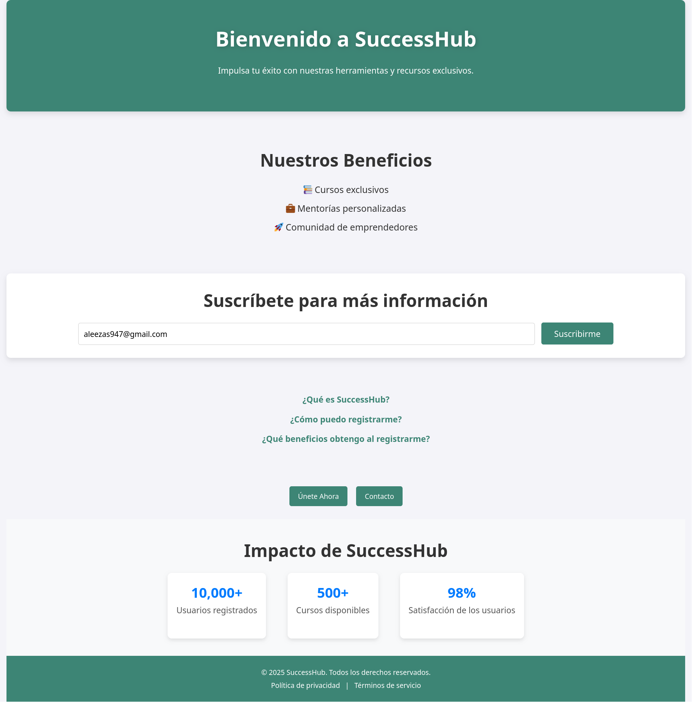
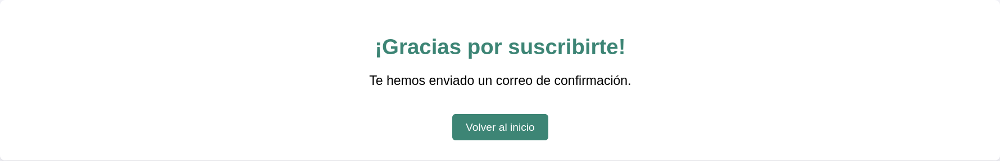
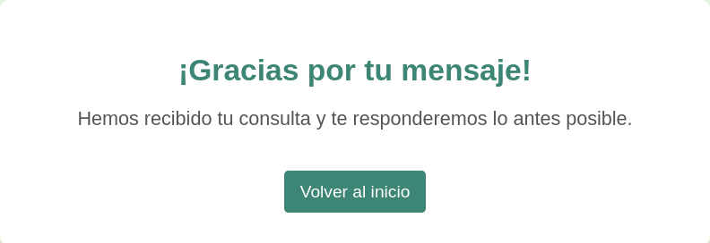

# SuccessHub

## Descripción

SuccessHub es una plataforma en línea diseñada para ayudar a las personas a alcanzar sus metas profesionales y personales. Ofrece cursos exclusivos, mentorías personalizadas y una comunidad de emprendedores.

 ## Características

- Página de inicio con introducción a SuccessHub.
- Sección de beneficios con lista de ventajas.
- Formulario de suscripción para recibir más información.
- Preguntas frecuentes con respuestas desplegables.
- Modal emergente para el registro de nuevos usuarios.
- Sección de impacto con estadísticas clave.
- Pie de página con enlaces a la política de privacidad y términos de servicio.

## Tecnologías Utilizadas

- HTML: Estructura de la página.
- CSS: Estilos y diseño responsivo.
- JavaScript: Interactividad en preguntas frecuentes y modales.

## Instalación y Uso

- Clona el repositorio o descarga los archivos.

- Abre index.html en tu navegador.

- Asegúrate de que style.css y script.js (si aplica) están en la misma carpeta.

## Funcionalidades Principales

- Modal de Registro: Un formulario emergente para registrarse en la plataforma.
- Sección de FAQ: Preguntas frecuentes con respuestas desplegables.
- Botón de Suscripción: Permite a los usuarios ingresar su correo para recibir información.
- Animaciones y Transiciones: Efectos sutiles en botones y contenedores para mejorar la experiencia del usuario.

# Página "Gracias por suscribirte"
## Resumen

La página "Gracias por suscribirte" es una página de agradecimiento que se muestra después de que un usuario se suscribe a SuccessHub. Esta página confirma la suscripción y notifica al usuario que se ha enviado un correo de confirmación. También proporciona un botón para regresar a la página de inicio.

## Características

- Mensaje de Agradecimiento: Muestra un mensaje agradeciendo al usuario por suscribirse.
- Notificación de Confirmación: Informa al usuario que se ha enviado un correo de confirmación a su bandeja de entrada.
- Botón de Regreso: Un botón que permite a los usuarios regresar a la página de inicio.

## Tecnologías Utilizadas

- HTML: Para la estructura de la página y su contenido.
- CSS: Para estilizar la página y el botón con efectos al pasar el cursor.

## Componentes Clave

### Contenedor de Agradecimiento

Un contenedor centrado que contiene el mensaje de agradecimiento, la notificación de confirmación y el botón de regreso.

## Cómo Usar

- Después de que un usuario se suscribe, será redirigido a esta página.
- Los usuarios verán el mensaje de agradecimiento y se les notificará sobre el correo de confirmación.
- Pueden hacer clic en el botón "Volver al inicio" para regresar a la página principal.

# Página "Gracias por tu mensaje"
## Resumen

Página que agradece al usuario por su mensaje y le informa que su consulta ha sido recibida. Incluye un botón para regresar al inicio.

## Características

- Mensaje de agradecimiento.
- Notificación de recepción de consulta.
- Botón de regreso.

## Tecnologías

- HTML: Estructura de la página.
- CSS: Estilo y efectos en el botón.

## Uso

- El usuario es redirigido a esta página después de enviar su mensaje.
- Puede hacer clic en "Volver al inicio" para regresar.

